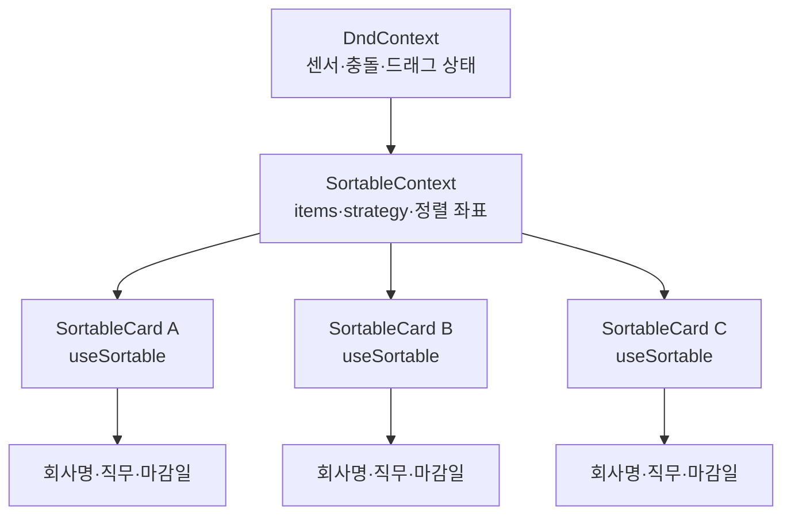
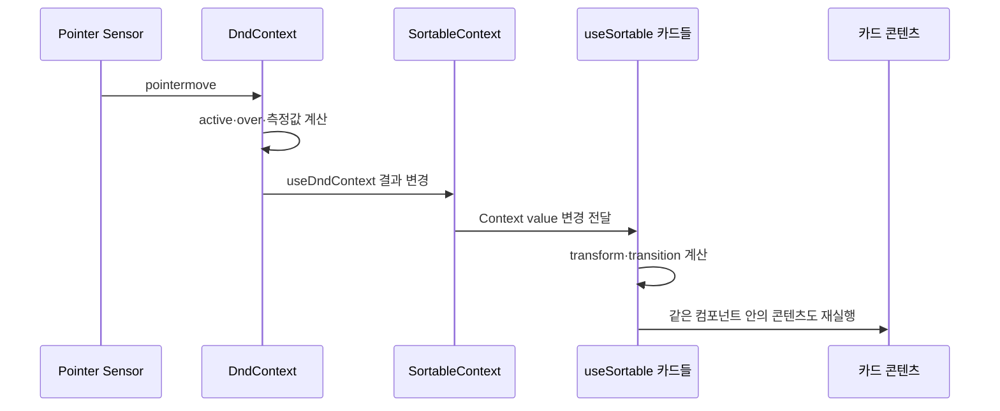

JobSecretary 칸반 보드에서 카드 하나를 드래그했을 뿐인데 이동하지 않은 카드까지 함께 렌더링되는 현상을 발견했습니다. React Developer Tools Profiler로 같은 드래그 시나리오를 비교한 결과, 기록된 전체 커밋은 **271회에서 98회로**, 비활성 카드의 렌더링은 **268회에서 0회로** 줄었습니다.

결론부터 말하면 이 문제의 본질은 “`dnd-kit`은 원래 느리다”가 아닙니다. `useSortable`이 정렬 상태를 읽는 컴포넌트와 회사명·직무·마감일을 그리는 컴포넌트가 같은 렌더링 경계에 있었던 것이 핵심이었습니다. `@hello-pangea/dnd`로 교체하면서 Render Props API가 이 경계를 드러내기 쉬워졌지만, 같은 경계 분리는 `dnd-kit`에서도 구현할 수 있습니다.

이 글에서 말하는 “고질적인 문제”는 모든 프로젝트에서 반드시 발생하는 라이브러리 버그가 아니라, 다음 조건이 겹칠 때 반복적으로 나타나는 구조적 문제를 뜻합니다.

1. 여러 아이템이 하나의 `SortableContext`를 구독합니다.
2. 드래그 중 `activeIndex`, `overIndex`, `transform`처럼 자주 변하는 값이 바뀝니다.
3. 드래그 연결 로직과 무거운 카드 UI가 같은 컴포넌트에 있습니다.
4. `React.memo`를 적용했지만 컴포넌트가 Context를 직접 읽거나, 매번 새 객체·함수를 Props로 받습니다.

<figure className="not-prose">
  <ZoomableImage
    src="/images/blog/dnd-kit-rendering-boundaries.png"
    alt="왼쪽은 SortableContext의 변화가 여러 카드로 전파되는 구조, 가운데는 드래그 셸과 카드 콘텐츠가 분리된 구조, 오른쪽은 Portal로 스크롤 컨테이너 밖에 드래그 카드를 표시하는 구조"
    loading="lazy"
    decoding="async"
    className="h-auto w-full rounded-2xl border border-card-border bg-foreground/5"
  />
  <figcaption>생성 이미지의 도형은 개념을 설명하기 위한 보조 자료이며, 실제 수치와 API 이름은 본문의 코드와 출처를 기준으로 확인해야 합니다.</figcaption>
</figure>

## 문제를 어떻게 측정했는가

이번 글의 수치는 JobSecretary에서 동일한 카드를 같은 위치로 드래그하는 시나리오를 React Developer Tools Profiler로 기록한 결과입니다. 절대적인 `dnd-kit` 벤치마크가 아니라, 같은 프로젝트에서 구조를 바꾼 전후를 비교한 값입니다.

| 항목 | 변경 전 | 변경 후 | 변화 |
| --- | ---: | ---: | ---: |
| 한 번의 드래그에서 기록된 전체 커밋 | 271회 | 98회 | 63.8% 감소 |
| 실제 변경이 없던 카드 렌더링 | 268회 | 0회 | 100% 감소 |

이 측정은 브라우저, React 실행 모드, 카드 수, 센서 설정에 따라 달라질 수 있습니다. 특히 개발 모드의 Strict Mode나 Profiler 자체의 측정 비용이 결과에 영향을 줄 수 있으므로, 이 숫자를 라이브러리 간 일반적인 성능 순위로 해석하지 않았습니다.

## dnd-kit의 Sortable 구조는 무엇을 구독하는가

`dnd-kit`의 sortable preset은 `SortableContext`가 정렬 정보를 제공하고, 각 아이템의 `useSortable`이 그 정보를 읽는 구조입니다. 공식 문서도 `useSortable`을 `useDraggable`과 `useDroppable`을 조합한 Hook으로 설명하며, Hook은 상위 `SortableContext`의 하위 컴포넌트에서 사용해야 한다고 명시합니다. [Sortable 공식 문서](https://docs.dndkit.com/presets/sortable)

구조를 단순화하면 다음과 같습니다.



`SortableContext`의 역할은 단순히 아이디 배열을 보관하는 것이 아닙니다. 정렬 전략이 계산할 수 있도록 `items`, `activeIndex`, `overIndex`, 측정된 사각형(`sortedRects`), `useDragOverlay` 등의 값을 Context로 묶어 하위 아이템에 전달합니다. 공식 저장소의 `SortableContext.tsx`는 `useDndContext()`에서 `active`, `over`, `droppableRects`를 읽고, 이를 바탕으로 Context value를 `useMemo`로 생성합니다. [SortableContext.tsx 소스](https://github.com/clauderic/dnd-kit/blob/master/packages/sortable/src/components/SortableContext.tsx)

```tsx
// dnd-kit 저장소의 핵심 흐름을 단순화한 형태입니다.
const {
  active,
  over,
  droppableRects,
  measureDroppableContainers,
} = useDndContext();

const activeIndex = active ? items.indexOf(active.id) : -1;
const overIndex = over ? items.indexOf(over.id) : -1;

const contextValue = useMemo(
  () => ({
    activeIndex,
    overIndex,
    items,
    sortedRects: getSortedRects(items, droppableRects),
    strategy,
  }),
  [activeIndex, overIndex, items, droppableRects, strategy],
);

return (
  <Context.Provider value={contextValue}>
    {children}
  </Context.Provider>
);
```

그리고 `useSortable`은 이 Context를 직접 읽습니다. 현재 저장소의 Hook을 보면 첫 단계에서 `useContext(Context)`로 `items`, `activeIndex`, `overIndex`, `sortedRects`, `strategy`를 꺼내고, 이어서 `useDroppable`과 `useDraggable`을 호출합니다. 마지막에는 정렬 전략으로 계산한 `transform`과 `transition`을 반환합니다. [useSortable.ts 소스](https://github.com/clauderic/dnd-kit/blob/master/packages/sortable/src/hooks/useSortable.ts)

```tsx
// useSortable.ts의 중요한 부분을 개념적으로 줄인 코드
const {
  items,
  activeIndex,
  overIndex,
  sortedRects,
  strategy,
} = useContext(Context);

const {transform, listeners, attributes, setNodeRef} = useDraggable({
  id,
  data,
});

const finalTransform = shouldDisplace
  ? strategy({
      rects: sortedRects,
      activeNodeRect,
      activeIndex,
      overIndex,
      index,
    })
  : null;

return {
  items,
  listeners,
  attributes,
  setNodeRef,
  transform: derivedTransform ?? finalTransform,
};
```

여기서 중요한 사실은 `useMemo`가 Context 구독을 선택적으로 만들어 주지 않는다는 점입니다. `useMemo`는 Provider가 만드는 value를 재사용할 뿐이고, 의존성 중 하나가 바뀌어 새 value가 만들어지면 해당 Context를 읽는 소비자는 업데이트 대상이 됩니다. 이것은 “모든 카드의 DOM이 매 프레임 다시 그려진다”는 뜻과는 다릅니다. React가 컴포넌트 함수를 다시 호출하는 것과 실제 DOM 변경, 브라우저 페인트는 서로 다른 단계이기 때문입니다. 다만 카드 하나의 좌표 계산을 위해 카드 전체 함수가 다시 호출되면, 그 안의 비싼 UI 계산·자식 생성·Hook 실행이 함께 비용을 낼 수 있습니다.

## 왜 드래그 중 Context 변경이 넓게 퍼지는가

포인터가 움직일 때 센서는 현재 위치를 갱신하고, `DndContext`는 활성 아이템과 충돌 대상을 다시 계산합니다. `SortableContext`는 그 결과를 `activeIndex`, `overIndex`, `sortedRects` 같은 값으로 변환합니다. 이 값은 정렬 가능한 모든 아이템이 참고할 수 있어야 하므로, 각 `useSortable` 소비자에게 전달됩니다.



이 설계는 기능적으로 자연스럽습니다. 다른 카드도 현재 위치에 따라 이동해야 하므로 정렬 계산에 참여해야 합니다. 문제는 정렬 계산과 카드 콘텐츠의 책임을 하나의 컴포넌트에 같이 넣었을 때 생깁니다.

```tsx
function SortableCard({application}: {application: Application}) {
  const {
    attributes,
    listeners,
    setNodeRef,
    transform,
    transition,
  } = useSortable({id: application.id});

  // transform이 바뀌지 않은 카드라도 이 컴포넌트 함수가 다시 호출될 수 있습니다.
  return (
    <article
      ref={setNodeRef}
      style={{transform: CSS.Transform.toString(transform), transition}}
      {...attributes}
      {...listeners}
    >
      <CompanyLogo src={application.logo} />
      <h3>{application.company}</h3>
      <p>{application.role}</p>
      <Deadline value={application.deadline} />
      <DeleteButton id={application.id} />
    </article>
  );
}
```

이 컴포넌트는 두 가지 일을 동시에 합니다.

| 책임 | 드래그에 필요한가 | 자주 변하는가 |
| --- | --- | --- |
| `setNodeRef`, `listeners`, `attributes` 연결 | 예 | 드래그 중 변할 수 있음 |
| `transform`, `transition` 스타일 계산 | 예 | 위치가 바뀔 때 변함 |
| 회사 로고, 회사명, 직무 렌더링 | 아니오 | 데이터가 바뀔 때만 변하면 충분 |
| 삭제 버튼, 상세 페이지 이동 핸들러 | 아니오 | 함수 참조가 안정적이면 충분 |

즉, 모든 카드가 정렬 계산을 구독해야 한다는 사실과 모든 카드 콘텐츠가 매번 다시 계산되어야 한다는 결론은 같지 않습니다. 이 둘을 분리하는 것이 이번 최적화의 핵심입니다.

## React.memo를 먼저 적용했는데 왜 충분하지 않았는가

`React.memo`는 부모가 전달한 Props를 비교해 Props가 같으면 컴포넌트의 재렌더링을 건너뛸 수 있게 합니다. React 공식 문서도 `memo`를 성능 최적화 수단으로 설명하며, Props가 객체·함수일 때 참조가 매번 바뀌지 않도록 설계해야 효과를 얻는다고 안내합니다. [React.memo 공식 문서](https://react.dev/reference/react/memo)

하지만 `memo`로 감싼 컴포넌트가 Context를 직접 읽으면 이야기가 달라집니다.

```tsx
const Card = memo(function Card({application}: Props) {
  const sortable = useSortable({id: application.id});

  // application Props가 같아도 useSortable이 읽은 Context가 바뀌면
  // Card는 드래그 상태를 반영하기 위해 다시 실행될 수 있습니다.
  return <CardView application={application} sortable={sortable} />;
});
```

`memo`는 Context 소비자를 Context 변경으로부터 격리하는 장치가 아닙니다. 그래서 다음과 같은 구조가 더 효과적입니다.

```tsx
const CardContent = memo(function CardContent({
  company,
  role,
  deadline,
  onDelete,
}: CardContentProps) {
  return (
    <>
      <h3>{company}</h3>
      <p>{role}</p>
      <Deadline value={deadline} />
      <DeleteButton onClick={onDelete} />
    </>
  );
});

function SortableCardShell({application, onDelete}: Props) {
  const {setNodeRef, listeners, attributes, transform, transition} =
    useSortable({id: application.id});

  return (
    <article
      ref={setNodeRef}
      style={{transform: CSS.Transform.toString(transform), transition}}
      {...attributes}
      {...listeners}
    >
      <CardContent
        company={application.company}
        role={application.role}
        deadline={application.deadline}
        onDelete={onDelete}
      />
    </article>
  );
}
```

이제 `SortableCardShell`은 Context를 구독하고 드래그 스타일을 계산하지만, `CardContent`는 `useSortable`을 호출하지 않습니다. `company`, `role`, `deadline`, `onDelete`의 참조가 같다면 `CardContent`는 부모 셸이 다시 실행되어도 렌더링을 건너뛸 수 있습니다.

이 글에서는 이 구조를 **렌더링 경계 분리(Render Boundary Isolation)**라고 부르겠습니다. React의 별도 API 이름이 아니라, “빠르게 변하는 상태를 읽는 컴포넌트와 안정적인 화면을 그리는 컴포넌트를 서로 다른 경계에 둔다”는 설계 원칙을 설명하기 위한 표현입니다.

## Render Props는 무엇이고 dnd-kit 문제와 어떻게 연결되는가

Render Props는 컴포넌트가 계산한 값을 함수의 인자로 넘기고, 호출자가 그 값을 사용해 무엇을 렌더링할지 결정하는 패턴입니다. 함수 이름이 반드시 `render`일 필요는 없습니다. React의 Render Props 문서도 `children`에 함수를 전달하는 방식까지 Render Props로 설명합니다. [Render Props 공식 문서](https://legacy.reactjs.org/docs/render-props.html)

```tsx
function Mouse({children}: {children: (position: Point) => React.ReactNode}) {
  const [position, setPosition] = useState({x: 0, y: 0});

  useEffect(() => {
    const handleMove = (event: MouseEvent) =>
      setPosition({x: event.clientX, y: event.clientY});

    window.addEventListener('mousemove', handleMove);
    return () => window.removeEventListener('mousemove', handleMove);
  }, []);

  return children(position);
}

function Screen() {
  return (
    <Mouse>
      {({x, y}) => <p>현재 좌표: {x}, {y}</p>}
    </Mouse>
  );
}
```

`@hello-pangea/dnd`의 `Draggable`도 같은 방식으로 `provided`와 `snapshot`을 자식 함수에 전달합니다.

```tsx
<Draggable draggableId={application.id} index={index}>
  {(provided, snapshot) => (
    <KanbanCard
      application={application}
      provided={provided}
      isDragging={snapshot.isDragging}
      onDelete={onDelete}
    />
  )}
</Draggable>
```

여기서 `provided`에는 `innerRef`, `draggableProps`, `dragHandleProps`가 들어 있고, `snapshot.isDragging`은 현재 아이템의 드래그 여부를 표현합니다. 라이브러리가 계산한 값을 애플리케이션 컴포넌트에 전달하는 API이지, Render Props 자체가 렌더링을 줄이는 알고리즘은 아닙니다.

오히려 Render Props에는 주의할 점도 있습니다. 다음처럼 매 렌더링마다 새 함수를 만들면 함수 참조가 바뀝니다.

```tsx
<PureWrapper render={(value) => <Card value={value} />} />
```

React의 문서도 Render Props 함수를 `render` 안에서 새로 만들면 `PureComponent`의 얕은 비교 이점을 무효화할 수 있다고 설명합니다. 따라서 Render Props를 썼다는 이유만으로 부모와 자식이 자동으로 메모이제이션되는 것은 아닙니다. [Render Props의 주의점](https://legacy.reactjs.org/docs/render-props.html#be-careful-when-using-render-props-with-reactpurecomponent)

이번 사례에서 Render Props가 유용했던 이유는 “성능 마법”이 아니라, 라이브러리 값과 카드 UI의 접점을 눈에 보이게 만들었기 때문입니다.

```text
Draggable의 render prop
  └─ 드래그 연결 정보와 snapshot을 받는 KanbanCardShell
       └─ 일반 Props만 받는 memo(KanbanCardContent)
```

## JobSecretary에서 실제로 바꾼 구조

JobSecretary의 현재 칸반 구현은 `DragDropContext`, `Droppable`, `Draggable`을 사용하는 `@hello-pangea/dnd` 기반입니다. 컬럼은 `Droppable`의 render prop으로 `provided.innerRef`, `provided.droppableProps`, `snapshot.isDraggingOver`를 받고, 카드 목록은 `Draggable`의 render prop으로 `provided`와 `snapshot`을 받습니다. [kanban-column.tsx](https://github.com/kimjunha1231/JobSecretary/blob/main/features/document-kanban/ui/kanban-column.tsx)

```tsx
<Droppable droppableId={status}>
  {(provided, snapshot) => (
    <section
      ref={provided.innerRef}
      {...provided.droppableProps}
      data-dragging-over={snapshot.isDraggingOver}
    >
      {applications.map((application, index) => (
        <Draggable
          key={application.id}
          draggableId={application.id}
          index={index}
        >
          {(provided, snapshot) => (
            <KanbanCard
              application={application}
              provided={provided}
              isDragging={snapshot.isDragging}
              onDelete={onDelete}
            />
          )}
        </Draggable>
      ))}
      {provided.placeholder}
    </section>
  )}
</Droppable>
```

카드 파일에서는 드래그 셸과 콘텐츠를 분리하고 콘텐츠에 `memo`를 적용했습니다. 콘텐츠는 `application`과 `onDelete`만 받으며 `Draggable`의 `provided`나 `snapshot`을 직접 알지 않습니다. [kanban-card.tsx](https://github.com/kimjunha1231/JobSecretary/blob/main/features/document-kanban/ui/kanban-card.tsx)

```tsx
const KanbanCardContent = memo(function KanbanCardContent({
  application,
  onDelete,
}: {
  application: Document;
  onDelete: (id: string) => void;
}) {
  const router = useRouter();
  const dDay = getDDay(application.deadline);

  return (
    <div onClick={() => router.push(`/document/${application.id}`)}>
      <h3>{application.company}</h3>
      <p>{application.role}</p>
      <p>{formatDeadline(application.deadline)}</p>
      <button onClick={() => onDelete(application.id)}>삭제</button>
    </div>
  );
});

export function KanbanCard({
  application,
  onDelete,
  provided,
  isDragging,
}: KanbanCardProps) {
  const card = (
    <article
      ref={provided.innerRef}
      {...provided.draggableProps}
      {...provided.dragHandleProps}
      style={getStyle(provided.draggableProps.style, isDragging)}
    >
      <KanbanCardContent
        application={application}
        onDelete={onDelete}
      />
    </article>
  );

  return isDragging && typeof document !== 'undefined'
    ? createPortal(card, document.body)
    : card;
}
```

여기서 `KanbanCard`가 드래그 상태에 따라 다시 실행되는 것과 `KanbanCardContent`가 실제 DOM을 다시 만드는 것은 분리됩니다. 다만 `application` 객체가 상위에서 매번 새로 만들어지거나 `onDelete`가 매 렌더링마다 새 함수로 생성되면 `memo`도 다시 실행됩니다. 따라서 다음과 같은 상위 코드도 함께 확인해야 합니다.

```tsx
const handleDelete = useCallback((id: string) => {
  deleteApplication(id);
}, [deleteApplication]);

const applications = useMemo(() => {
  return documentsByStatus[status];
}, [documentsByStatus, status]);
```

`memo`에 객체 전체를 넘기는 대신 콘텐츠가 실제로 필요로 하는 최소한의 필드만 넘기는 것도 좋은 방법입니다. React 공식 문서 역시 Props를 최소화하고, 불필요하게 새 객체를 만들지 않는 방식을 권장합니다. [Props 변경을 줄이는 memo 사용법](https://react.dev/reference/react/memo#minimizing-props-changes)

## 라이브러리를 꼭 바꿔야 했을까

리렌더링 문제만 놓고 보면 꼭 바꿀 필요는 없었습니다. `dnd-kit`에서도 다음처럼 `useSortable`을 외곽 셸에만 두고, 카드 콘텐츠를 순수 컴포넌트로 분리할 수 있습니다.

```tsx
const SortableCardContent = memo(function SortableCardContent({
  company,
  role,
  deadline,
}: {
  company: string;
  role: string;
  deadline: string;
}) {
  return (
    <>
      <h3>{company}</h3>
      <p>{role}</p>
      <p>{deadline}</p>
    </>
  );
});

function SortableCard({application}: {application: Application}) {
  const {
    attributes,
    listeners,
    setNodeRef,
    setActivatorNodeRef,
    transform,
    transition,
  } = useSortable({id: application.id});

  return (
    <article
      ref={setNodeRef}
      style={{
        transform: CSS.Transform.toString(transform),
        transition,
      }}
      {...attributes}
    >
      <button ref={setActivatorNodeRef} {...listeners} aria-label="드래그 핸들">
        이동
      </button>
      <SortableCardContent
        company={application.company}
        role={application.role}
        deadline={application.deadline}
      />
    </article>
  );
}
```

따라서 `@hello-pangea/dnd`로의 전환을 다음 두 가지로 구분해서 판단해야 합니다.

| 판단 기준 | 라이브러리 교체가 필요한가 |
| --- | --- |
| 드래그 상태와 카드 콘텐츠의 렌더링 범위를 분리 | 아니오. `dnd-kit`에서도 가능 |
| Render Props 형태의 `provided`·`snapshot` API가 팀에 더 읽기 쉬운가 | 팀의 선호와 기존 코드에 따라 다름 |
| 키보드 접근성, 센서, 다중 컨테이너 동작을 바꾸고 싶은가 | 기능 비교 후 별도 판단 |
| 현재 구현의 버그·유지보수 비용이 라이브러리 교체 비용보다 큰가 | 실제 기능·테스트 범위를 비교해야 함 |

즉 이번 개선 결과를 “라이브러리를 교체했더니 리렌더링이 0이 됐다”로 기록하면 원인과 결과를 과도하게 단순화하게 됩니다. 실제로는 Render Props로 전달 방식을 바꾼 것, 카드 셸과 콘텐츠를 나눈 것, 콘텐츠에 `memo`를 적용한 것, Props 참조를 안정화한 것이 함께 작용했습니다.

## Portal은 성능 최적화인가, DOM 배치 최적화인가

`React Portal`은 React 트리에서 논리적으로는 같은 위치에 있는 JSX를 다른 DOM 컨테이너에 렌더링하는 기능입니다. React 공식 문서에 따르면 Portal로 렌더링된 자식은 React 트리의 일부이므로 Context와 이벤트 전파는 React 트리 기준으로 동작합니다. [createPortal 공식 문서](https://react.dev/reference/react-dom/createPortal)

JobSecretary에서는 드래그 중인 카드를 `document.body`로 옮겨 윈도우 스크롤, `overflow`, `z-index`, stacking context의 영향을 줄였습니다.

```tsx
const card = (
  <article
    ref={provided.innerRef}
    {...provided.draggableProps}
    {...provided.dragHandleProps}
    style={provided.draggableProps.style}
  >
    <KanbanCardContent application={application} onDelete={onDelete} />
  </article>
);

return isDragging && typeof document !== 'undefined'
  ? createPortal(card, document.body)
  : card;
```

Portal이 해결하는 것은 다음과 같습니다.

- 스크롤 컨테이너가 자식의 시각적 영역을 잘라내는 문제
- 부모의 stacking context 때문에 드래그 카드가 뒤로 숨는 문제
- 문서 전체를 스크롤하는 환경에서 카드의 이동 기준이 어긋나는 문제

Portal이 해결하지 않는 것은 다음과 같습니다.

- `useSortable` Context 소비자의 재실행
- Props 참조가 매번 바뀌는 문제
- 카드 콘텐츠가 드래그 상태를 직접 구독하는 문제
- 정렬 전략 계산 자체의 비용

`dnd-kit`에서는 같은 목적을 위해 `DragOverlay`를 사용할 수도 있습니다. 공식 문서는 스크롤 컨테이너 안의 draggable이나 컨테이너 사이를 이동하는 아이템에는 `DragOverlay`를 권장하고, 필요하면 `createPortal(<DragOverlay />, document.body)` 형태로 다른 DOM 컨테이너에 렌더링할 수 있다고 설명합니다. [DragOverlay 공식 문서](https://docs.dndkit.com/api-documentation/draggable/drag-overlay)

```tsx
function Board() {
  const [activeId, setActiveId] = useState<string | null>(null);

  return (
    <DndContext
      onDragStart={({active}) => setActiveId(String(active.id))}
      onDragEnd={() => setActiveId(null)}
      onDragCancel={() => setActiveId(null)}
    >
      <SortableList />

      {createPortal(
        <DragOverlay>
          {activeId ? <CardPreview id={activeId} /> : null}
        </DragOverlay>,
        document.body,
      )}
    </DndContext>
  );
}
```

`DragOverlay`의 자식은 `useDraggable`나 `useSortable`을 다시 호출하지 않는 표현용 컴포넌트로 두는 것이 좋습니다. 드래그 로직을 시각적 카드와 분리하라는 공식 문서의 presentational component 패턴도 이 렌더링 경계 분리와 같은 방향입니다.

## 개선 과정에서 확인한 것과 확인하지 않은 것

이번 수치에서 확실하게 말할 수 있는 것은 같은 프로젝트의 같은 드래그 시나리오에서 Profiler에 기록된 렌더링 범위가 줄었다는 사실입니다. 다음 항목은 별도 실험 없이는 단정하지 않았습니다.

| 질문 | 이번 글의 판단 |
| --- | --- |
| 모든 브라우저에서 63.8%가 재현되는가 | 확인하지 않음 |
| 카드 수가 10배가 되어도 같은 비율인가 | 확인하지 않음 |
| 사용자 입력 지연이나 FPS가 같은 비율로 개선되는가 | Profiler 수치만으로 단정하지 않음 |
| 라이브러리 교체만으로 개선되었는가 | 아님. 여러 구조 변경의 결합 결과 |
| `dnd-kit`을 유지해도 같은 렌더링 경계가 가능한가 | 가능. 위의 셸·콘텐츠 분리로 구현 가능 |

Profiler에서 “렌더링 횟수”를 줄이는 것은 목표가 아니라 단서입니다. 실제 사용자가 느끼는 지연을 확인하려면 카드 수, 브라우저, Production build, 입력 장치, 긴 텍스트·이미지 로딩 여부를 고정하고 commit time, interaction latency, frame drop도 함께 측정해야 합니다.

## 재현 시 확인할 체크리스트

비슷한 문제가 생겼을 때는 라이브러리를 먼저 교체하기보다 다음 순서로 확인하는 것이 안전합니다.

1. React Profiler에서 드래그 시작부터 종료까지 한 번의 interaction을 기록합니다.
2. 실제로 다시 실행된 컴포넌트와 DOM이 변경된 컴포넌트를 구분합니다.
3. `useSortable` 또는 `useDraggable`을 호출하는 컴포넌트가 카드 콘텐츠까지 직접 그리는지 확인합니다.
4. Context를 읽는 셸과 Context를 읽지 않는 `memo` 콘텐츠를 분리합니다.
5. 콘텐츠에 넘기는 객체·함수 Props의 참조가 안정적인지 확인합니다.
6. 정렬 전략, 측정 빈도, 가상화 여부를 카드 수와 함께 검토합니다.
7. 스크롤·`overflow`·`z-index` 문제가 따로 있다면 `DragOverlay` 또는 Portal을 적용합니다.
8. 같은 시나리오를 Production build에서도 다시 측정합니다.

## 자주 묻는 질문

### `useSortable`을 쓰면 모든 카드가 항상 리렌더링되나요?

아닙니다. `useSortable`은 상위 `SortableContext` 정보를 읽기 때문에 Context 변경의 영향을 받을 수 있지만, 실제 재실행 범위는 컴포넌트 트리와 Props 구조에 따라 달라집니다. 정렬 셸과 카드 콘텐츠를 분리하면 콘텐츠의 불필요한 재실행을 줄일 수 있습니다.

### `React.memo`만 적용하면 해결되나요?

대부분의 경우 충분하지 않습니다. 컴포넌트가 Context를 직접 읽거나 객체·함수 Props가 매번 새로 만들어지면 `memo`의 비교가 통과하지 못할 수 있습니다. Context를 읽는 부분을 외곽으로 이동하고, 안쪽에는 안정적인 최소 Props만 전달해야 합니다.

### Render Props가 리렌더링을 막아 주나요?

아닙니다. Render Props는 계산된 값을 함수 인자로 전달하는 API 패턴입니다. 이번 사례에서는 `provided`와 `snapshot`을 드래그 셸에서만 소비하도록 경계를 만드는 데 도움이 됐습니다.

### Render Props와 render boundary isolation은 같은 개념인가요?

아닙니다. Render Props는 값을 전달하는 방식이고, render boundary isolation은 자주 변하는 상태와 안정적인 UI를 서로 다른 컴포넌트 경계에 배치하는 설계입니다. Render Props 없이도 경계를 만들 수 있고, Render Props를 사용해도 경계를 잘못 잡으면 모든 UI가 다시 실행될 수 있습니다.

### Portal을 적용하면 리렌더링이 줄어드나요?

Portal의 주목적은 DOM 배치입니다. React 트리와 Context 구독은 유지되므로 Portal만으로 `useSortable` 소비자의 리렌더링이 사라지지는 않습니다. `overflow`, stacking context, 스크롤 기준을 분리해야 할 때 사용합니다.

### 결국 `dnd-kit`을 바꿔야 하나요?

리렌더링 경계 문제만으로는 바꿀 필요가 없습니다. `dnd-kit`에서도 `useSortable`을 외곽 셸에 두고 `memo` 콘텐츠를 안쪽에 배치할 수 있습니다. 다만 팀의 API 선호, 접근성 요구, 센서·다중 컨테이너 동작, 기존 테스트와 유지보수 비용까지 비교해 라이브러리 선택을 결정해야 합니다.

## 정리

이번 문제를 통해 확인한 것은 “어떤 DnD 라이브러리가 더 빠른가”보다 “어떤 컴포넌트가 빠르게 변하는 상태를 구독하고 있는가”가 먼저라는 사실입니다.

`dnd-kit`의 `SortableContext`와 `useSortable`은 정렬 기능을 만들기 위해 Context로 필요한 정보를 전파합니다. 이 설계는 정상적인 기능 동작을 위한 것이지만, Context를 구독하는 카드 컴포넌트 안에 무거운 콘텐츠까지 넣으면 드래그 중 업데이트 비용이 넓어집니다.

해결은 세 층으로 나뉩니다.

- **상태 구독 경계**: `useSortable` 또는 `Draggable` 연결 정보는 외곽 셸이 담당합니다.
- **콘텐츠 경계**: 카드 데이터만 받는 순수 컴포넌트를 `memo`로 감쌉니다.
- **DOM 배치 경계**: 스크롤·`overflow` 문제가 있을 때 `DragOverlay`나 `createPortal`을 사용합니다.

Render Props는 이 경계를 표현하기 좋은 API일 뿐이고, Portal은 렌더링 성능을 위한 만능 해법이 아닙니다. 먼저 Profiler로 구독 범위를 확인하고, 라이브러리를 유지하든 교체하든 같은 원칙으로 렌더링 경계를 다시 설계해야 합니다.

## 참고 자료와 조사 범위

아래 자료는 2026년 7월 26일에 확인했습니다. 공식 문서의 설명, 공식 저장소의 현재 소스, JobSecretary 공개 저장소의 실제 구현, 프로젝트에서 기록한 Profiler 수치를 서로 구분해 사용했습니다.

| 출처 | 본문에서 확인한 내용 |
| --- | --- |
| [dnd-kit Sortable 개요](https://docs.dndkit.com/presets/sortable) | `SortableContext`와 `useSortable`의 역할, `useSortable`이 draggable·droppable을 조합한다는 설명 |
| [dnd-kit SortableContext 문서](https://docs.dndkit.com/presets/sortable/sortable-context) | `items`의 정렬 순서, sorting strategy, Context 기반 구조 |
| [dnd-kit useSortable 문서](https://docs.dndkit.com/presets/sortable/usesortable) | `transform`, `transition`, `setNodeRef`, listeners, activator의 의미 |
| [dnd-kit `SortableContext.tsx`](https://github.com/clauderic/dnd-kit/blob/master/packages/sortable/src/components/SortableContext.tsx) | `useDndContext`, `activeIndex`, `overIndex`, `sortedRects`, Context value 생성 흐름 |
| [dnd-kit `useSortable.ts`](https://github.com/clauderic/dnd-kit/blob/master/packages/sortable/src/hooks/useSortable.ts) | `useContext`, `useDraggable`, `useDroppable`, transform 계산과 반환값 |
| [dnd-kit DragOverlay 문서](https://docs.dndkit.com/api-documentation/draggable/drag-overlay) | scrollable container에서 Overlay를 권장하는 이유, Portal 적용 방법, presentational component 패턴 |
| [React `memo`](https://react.dev/reference/react/memo) | Context 변경, Props 참조 안정화, 최소 Props 설계에 관한 기준 |
| [React `createPortal`](https://react.dev/reference/react-dom/createPortal) | DOM 컨테이너 이동과 React 트리·이벤트 전파의 관계 |
| [React Render Props](https://legacy.reactjs.org/docs/render-props.html) | 함수 자식, `children` 함수, 새 함수 참조가 PureComponent에 미치는 주의점 |
| [JobSecretary `kanban-card.tsx`](https://github.com/kimjunha1231/JobSecretary/blob/main/features/document-kanban/ui/kanban-card.tsx) | `memo` 카드 콘텐츠, `createPortal`, `@hello-pangea/dnd` provided/snapshot 사용 |
| [JobSecretary `kanban-column.tsx`](https://github.com/kimjunha1231/JobSecretary/blob/main/features/document-kanban/ui/kanban-column.tsx) | `Droppable`·`Draggable` Render Props와 컬럼 구성 |

관련 프로젝트: [JobSecretary 프로젝트 상세 페이지](/projects/jobsecretary)
