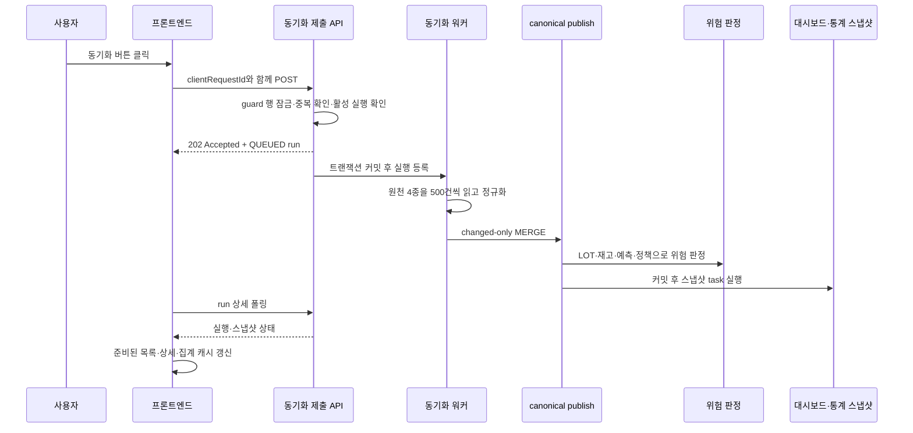
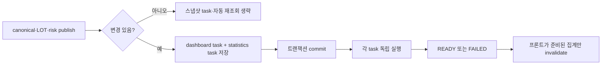

> StockFit 통합재고 개발 기록 · 동기화 실행 흐름

## 이 글에서 먼저 확인할 것

동기화 버튼은 클릭 한 번으로 끝나는 기능처럼 보이지만, 실제로는 다음 순서를 거칩니다.

1. 프론트엔드가 실행 요청을 만들고 중복 요청을 구분합니다.
2. 백엔드가 실행을 바로 수행하지 않고 `QUEUED` 상태로 접수합니다.
3. DB 트랜잭션이 커밋된 뒤 워커가 원천 데이터를 읽습니다.
4. 오프라인·이커머스·그리팅·물류센터 데이터를 공통 형태로 읽어 500건 단위로 모읍니다.
5. 바뀐 행만 상품·SKU·가격·LOT·정책·재고 canonical 테이블에 반영합니다.
6. 반영된 범위의 LOT 상태와 위험 판정을 같은 실행 기준으로 계산합니다.
7. 커밋 후 대시보드와 통계 스냅샷을 별도 작업으로 생성합니다.
8. 프론트엔드가 실행 상태와 스냅샷 상태를 폴링하고, 준비된 데이터만 다시 조회합니다.

여기서 `canonical`은 “네 원천 테이블을 물리적으로 하나로 합친 테이블”이 아닙니다. 원천마다 다른 컬럼과 표현을 서비스 내부의 공통 의미로 맞춘 뒤, 이미 나뉘어 있는 `PRODUCT`, `SKU`, `LOT`, `INVENTORY_BALANCE` 등에 반영한다는 뜻입니다.

### 기준 버전과 작업 트리 구분

이 글은 실제 저장소를 읽어 작성했지만, 작성 시점에 두 종류의 코드가 섞여 있습니다.

| 구분 | 확인한 기준 | 글에서의 표현 |
| --- | --- | --- |
| 병합된 기준 | BackEnd `develop` `fb9d384`, FrontEnd `develop` `3d1bf57` | `develop` 기준 |
| 아직 커밋되지 않은 변경 | BackEnd 위험 정책·판정 코드, FrontEnd 위험 표시 코드 | 현재 작업 트리 |

현재 작업 트리에는 위험 규칙 `v1.7.0`이 들어와 있지만 `develop`의 정책 문서는 `v1.6.0`입니다. 따라서 위험 판정 절에서는 “현재 작업 트리에서 확인한 변경”과 “develop에 이미 병합된 동작”을 구분합니다. 병합되지 않은 코드를 배포 완료처럼 쓰지 않습니다.

## 0. 전체 흐름을 먼저 그림으로 보기



이 도식은 실행 순서를 보여주는 개념도입니다. 처리 시간이나 처리량을 측정한 결과를 의미하지는 않습니다.

<figure className="not-prose my-6">
  <ZoomableImage
    src="/images/blog/integrated-inventory-sync-architecture-ai.png"
    alt="원천 재고 네 종류가 공통 형식으로 정규화된 뒤 canonical, 위험 판정, 대시보드와 통계, 화면으로 이어지는 통합재고 동기화 흐름"
    loading="lazy"
    decoding="async"
    className="h-auto w-full rounded-2xl border border-card-border bg-foreground/5"
  />
  <figcaption>통합재고 동기화의 전체 책임 경계와 데이터 흐름을 한눈에 볼 수 있도록 정리한 도식입니다.</figcaption>
</figure>

## 1. 버튼을 누른 순간: 화면 잠금만으로는 충분하지 않습니다

버튼을 빠르게 두 번 누르거나, 네트워크 응답이 늦어 사용자가 다시 누르거나, 다른 탭에서 동시에 실행할 수 있습니다. 프론트엔드의 `disabled`는 현재 화면에서만 동작하므로, 최종 중복 방어는 서버가 맡아야 합니다.

### 1.1 프론트엔드는 요청 식별자를 먼저 만듭니다

`InventorySyncControl.jsx`는 요청마다 `clientRequestId`를 준비합니다. 아직 실행 결과를 모르는 `START_UNCERTAIN` 상태에서는 같은 키를 유지합니다. 전송은 됐지만 응답만 놓친 경우, 새 작업을 만드는 대신 원래 요청의 결과를 다시 찾기 위해서입니다.

```jsx
const nextClientRequestId = NEW_REQUEST_UI_STATES.has(derivedUiState)
  ? createClientRequestId()
  : clientRequestId;
```

이미 `SUCCEEDED`나 `FAILED`로 끝난 실행에서 사용자가 새로 누르면 새 키를 만듭니다. 반대로 전송 결과가 불확실하면 기존 키를 재사용합니다.

이 성질을 멱등성이라고 합니다. 같은 요청을 여러 번 보내도 서버가 같은 실행을 가리키게 만드는 성질입니다. 이 프로젝트에서 멱등 키는 서버가 만든 `syncRunId`와 구분됩니다.

| 값 | 의미 | 만들어지는 시점 |
| --- | --- | --- |
| `clientRequestId` | “이 요청을 이미 보냈는가?”를 확인하는 클라이언트 키 | 버튼 클릭 전 |
| `syncRunId` | 접수된 동기화 실행 한 건의 DB 식별자 | 서버가 `QUEUED` 행을 저장할 때 |

### 1.2 현재 구현의 중요한 세부 사항: 요청 해시는 무엇을 해시하는가

백엔드 요청 DTO는 현재 `clientRequestId` 하나만 받습니다.

```java
public record InventorySyncStartRequest(
        @NotBlank @Size(min = 16, max = 80)
        @Pattern(regexp = "[A-Za-z0-9_-]+")
        String clientRequestId
) { }
```

`InventorySyncSubmissionService.requestHash()`도 이 값을 trim한 뒤 SHA-256으로 해시합니다.

```java
public static String requestHash(InventorySyncStartRequest request) {
    return InventorySyncHash.sha256Hex(request.clientRequestId().trim());
}
```

따라서 현재의 `requestHash`는 “여러 실행 옵션 전체를 해시한 값”이 아니라 `clientRequestId`를 저장한 값에 가깝습니다. 나중에 원천 범위, 기준일 같은 요청 필드가 추가된다면 해시 대상도 함께 넓혀야 합니다. 이 글에서는 현재 DTO에 실제로 존재하는 값만 설명합니다.

## 2. 제출 API의 트랜잭션: 긴 작업을 HTTP 요청 안에서 기다리지 않습니다

버튼 요청은 동기화 전체를 끝낸 뒤 응답하지 않습니다. `QUEUED` 실행을 먼저 저장하고 `202 Accepted`를 반환합니다. `202`는 “요청을 받았고 처리를 시작할 수 있는 상태지만, 최종 결과는 아직 나오지 않았다”는 의미로 사용됩니다.

### 2.1 서버가 접수할 때 확인하는 순서

`InventorySyncSubmissionService.submitInternal()`의 핵심 순서는 다음과 같습니다.

1. 요청자 ID가 유효한지 확인합니다.
2. `inventory_source_state`의 고정 guard 행을 `FOR UPDATE WAIT 5`로 잠급니다.
3. 같은 `clientRequestId`가 이미 있는지 확인합니다.
4. 수동 실행이면 사용자별 최소 간격 10초와 시간당 60회 제한을 확인합니다.
5. 이미 `QUEUED`, `RUNNING`, `INTERRUPTED`인 실행이 있는지 확인합니다.
6. 새 실행을 `QUEUED`로 저장합니다.
7. 트랜잭션 커밋 이후 워커를 깨우도록 등록합니다.
8. 프론트엔드에 `202`와 실행 정보를 반환합니다.

서버 쪽 로직을 간단히 줄이면 다음과 같습니다.

```text
guard 행 잠금
  → 같은 clientRequestId 확인
  → 활성 실행 확인
  → QUEUED 실행 저장
  → 커밋 후 워커 실행
  → 202 Accepted
```

### 2.2 비관적 락은 왜 사용하는가

비관적 락은 “다른 요청이 동시에 들어올 수 있다”고 보고 DB 행을 먼저 잠그는 방식입니다. 이 프로젝트는 제출 경쟁을 직렬화하기 위해 고정된 source-state 행을 잠급니다. Oracle에서 5초 안에 잠금을 얻지 못하면 `InventorySyncLockSupport`가 잠금 대기 오류를 동기화 충돌 응답으로 바꿉니다.

프론트엔드 버튼을 잠그는 것과 역할이 다릅니다.

| 방어 위치 | 막는 문제 | 한계 |
| --- | --- | --- |
| 프론트엔드 `disabled` | 같은 화면의 연속 클릭 | 다른 탭·다른 서버를 모름 |
| 백엔드 비관적 락 | 동시에 제출하는 서버 요청 | 잠금 대기와 타임아웃을 처리해야 함 |
| DB 유니크 제약 | 마지막 중복 삽입 | 사용자에게 친절한 상태를 만들기 어렵고 예외 처리가 필요함 |

이 프로젝트는 세 번째 방어선으로 `active_scope_key` 유니크 제약도 유지합니다. 애플리케이션 확인과 DB 제약을 함께 두어 한쪽 판단이 놓친 경쟁을 막습니다.

## 3. 왜 `QUEUED`를 저장한 뒤 커밋 후 워커를 시작할까

실행 행을 저장하는 트랜잭션이 끝나기 전에 비동기 워커를 시작하면, 워커가 아직 커밋되지 않은 실행 행을 읽지 못할 수 있습니다. 그러면 사용자는 `202`를 받았는데 워커는 실행 ID를 찾지 못하는 상황이 생깁니다.

그래서 제출 서비스는 `TransactionSynchronizationManager`에 `afterCommit` 콜백을 등록합니다.

```java
runMapper.insertRun(run);

TransactionSynchronizationManager.registerSynchronization(new TransactionSynchronization() {
    @Override
    public void afterCommit() {
        launcher.launch(runId);
    }
});
```

여기서 핵심은 비동기라는 단어 자체가 아닙니다. “워커가 읽을 durable한 실행 행이 먼저 저장되어야 한다”는 순서입니다. `durable`은 메모리 변수에만 남아 있지 않고 DB에 저장되어 재시작 뒤에도 다시 찾을 수 있다는 뜻입니다.

워커 큐가 가득 차 `launch()`가 실패하면 실행 행을 조용히 잃지 않고 `markLaunchFailed()` 경로로 실패를 기록합니다. 사용자가 계속 로딩 화면만 보지 않도록 실행 상태를 남기는 구조입니다.

## 4. 원천 데이터 읽기: 네 테이블을 한 번에 UNION하지 않습니다

현재 원천은 다음 네 종류입니다.

| `sourceType` | 원천 current 테이블 | 공통 의미로 바꾸는 대표 값 |
| --- | --- | --- |
| `OFFLINE` | `inventory_source_offline` | `available_stock_count` → `on_hand_qty` |
| `ECOMMERCE` | `inventory_source_ecommerce` | `sellable_quantity` → `on_hand_qty` |
| `GREETING` | `inventory_source_greeting` | `saleable_meal_count` → `on_hand_qty` |
| `WAREHOUSE` | `inventory_source_warehouse` | `physical_available_qty` → `on_hand_qty` |

### 4.1 실제 정규화 위치는 SQL projection입니다

원천별 컬럼명을 같은 결과 컬럼으로 맞추는 일은 `InventorySyncSourcePageMapper.xml`의 `<choose>` projection에서 수행합니다. 예를 들어 이커머스의 `sellable_quantity`와 물류센터의 `physical_available_qty`가 둘 다 `on_hand_qty`라는 결과 별칭으로 나옵니다.

```sql
-- ECOMMERCE
sellable_quantity AS on_hand_qty,
ordered_quantity AS reserved_qty

-- WAREHOUSE
physical_available_qty AS on_hand_qty,
physical_reserved_qty AS reserved_qty
```

따라서 Java의 Source Adapter가 원천 컬럼을 모두 다시 번역하는 구조는 아닙니다. SQL이 DB에서 조인과 컬럼 정규화를 끝내 `CanonicalInventoryRecord`로 투영하고, Java 어댑터는 `sourceType`이 맞는지 확인한 뒤 버퍼에 넣는 계약을 담당합니다.

```java
default void accept(CanonicalInventoryRecord record, InventorySyncAttemptBuffer buffer) {
    if (!sourceType().equals(record.sourceType())) {
        throw new IllegalArgumentException("source type mismatch: expected " + sourceType());
    }
    buffer.add(record);
}
```

이 구분을 놓치면 “어댑터가 모든 데이터 변환을 한다”고 잘못 이해하게 됩니다. 현재 구현의 책임은 다음과 같습니다.

```text
MyBatis projection
  → 원천별 컬럼명·코드·날짜를 공통 결과 컬럼으로 정규화

Java Source Adapter
  → sourceType 계약 확인
  → changed-set buffer에 수용

CanonicalBatchWriter
  → 정식 테이블에 MERGE
```

### 4.2 500건 페이지와 keyset 방식

워커는 한 원천을 전부 메모리에 읽지 않고 500건씩 읽습니다. 다음 페이지를 `OFFSET 500`처럼 건너뛰는 대신 마지막 `source_record_key` 이후를 읽습니다.

```sql
WHERE m.source_type = #{sourceType}
  AND st.current_version = #{sourceVersion}
  AND (src.synced_record_hash IS NULL OR src.record_hash != src.synced_record_hash)
  AND m.source_record_key > #{lastSourceRecordKey}
ORDER BY m.source_record_key
FETCH NEXT #{limit} ROWS ONLY
```

이 방식은 페이지를 읽는 동안 앞쪽 데이터가 바뀌어도 이미 읽은 키보다 뒤를 기준으로 이어갈 수 있다는 장점이 있습니다. 대신 `source_record_key`가 안정적으로 정렬되고, 원천 버전을 실행 중 고정해야 합니다. 워커는 원천별 `current_version`이 읽기 시작 후 바뀌었는지도 마지막에 확인합니다. 버전이 달라지면 `SOURCE_CHANGED`로 중단합니다.

## 5. canonical에 넣기 전: 매핑과 입력을 먼저 닫습니다

원천 행을 읽었다고 바로 정식 테이블을 수정하지 않습니다. 실행 전에 매핑이 유효한지 검사합니다.

`countInvalidOrUnmapped()`는 다음 종류를 찾습니다.

- 활성 원천 행에 `MAPPED` row map이 없는 경우
- `sku_id`, `warehouse_id`, `inventory_balance_id` 같은 필수 연결 ID가 없는 경우
- row map은 있지만 원천 current 행이 사라진 경우
- 여러 원천 행이 하나의 `inventory_balance_id`를 서로 다르게 가리키는 경우

이 검사는 데이터가 일부만 반영된 뒤 실패하는 상황을 줄입니다. 특히 이름이 비슷한 상품을 실행 중 추측하지 않고, 미리 승인된 `inventory_source_row_map`에 연결된 대상만 사용합니다.

### 5.1 `CanonicalInventoryRecord`는 내부 입력 경계입니다

`CanonicalInventoryRecord` 생성자는 정식 테이블에 쓰기 전의 최소 규칙을 검사합니다.

- 필수 식별자가 비어 있지 않은지
- 수량이 음수가 아닌지
- `reservedQty`가 `onHandQty`보다 크지 않은지
- `sourceVersion`, `rowVersion`이 양수인지
- 가격·원가·정책이 연결된 경우 해당 값이 유효한지

이 객체를 “통합재고 테이블”로 오해하면 안 됩니다. 실행 중 여러 원천 행을 같은 타입으로 보관하는 메모리 경계입니다.

## 6. 왜 바뀐 행만 반영하는가: `record_hash`와 `synced_record_hash`

원천 데이터가 3만 건 이상이어도 매번 모든 canonical 행을 업데이트할 필요는 없습니다. 원천 current 행에는 `record_hash`, 마지막으로 반영한 해시에는 `synced_record_hash`를 둡니다.

```text
record_hash        = 현재 원천 행의 내용 지문
synced_record_hash = 마지막 성공 동기화 때 반영한 지문

두 값이 같음  → canonical publish 대상 아님
두 값이 다름  → 이번 실행의 changed-set 후보
```

이 비교는 SQL에서 먼저 수행합니다.

```sql
AND (src.synced_record_hash IS NULL OR src.record_hash != src.synced_record_hash)
```

반영이 성공한 뒤 `markOfflineSynced`, `markEcommerceSynced`, `markGreetingSynced`, `markWarehouseSynced`가 `synced_record_hash`, `last_sync_run_id`, `last_synced_at`을 기록합니다.

### 6.1 `updated_at`을 원천 변경 감지의 기준으로 쓰지 않은 이유

`updated_at`만 비교하면 “값은 같지만 저장 시각만 바뀐 행”을 변경으로 오인할 수 있습니다. 반대로 외부 적재 과정의 시계 정밀도나 갱신 방식에 따라 값이 바뀌었는데 시간이 신뢰하기 어려운 경우도 있습니다. 현재 구현은 행 내용 기반 `record_hash`를 변경 감지에 사용합니다.

그렇다고 `updated_at`을 전혀 사용하지 않는 것은 아닙니다.

| 용도 | 현재 기준 |
| --- | --- |
| 원천 current 변경 감지 | `record_hash` ↔ `synced_record_hash` |
| canonical 감사 정보 | 실제 값이 달라질 때 `updated_at`, `updated_by` 갱신 |
| 수요예측 같은 동일 행의 값 변경 감지 | 현재 작업 트리 `v1.7.0`에서 forecast `updated_at` 비교 |
| 판정 시점 고정 | 실행 시작 시각 `startedAt`을 `assessmentInstant`로 전달 |

즉 `updated_at`은 변경 신호 하나로 모든 문제를 해결하는 필드가 아니라, 데이터마다 의미가 다른 보조 정보입니다.

### 6.2 canonical MERGE도 실제 값이 다를 때만 갱신합니다

예를 들어 재고 수량 MERGE는 대상 ID로 행을 찾은 뒤, 수량이 달라질 때만 `updated_at`을 바꿉니다.

```sql
WHEN MATCHED THEN UPDATE SET
    target.on_hand_qty = source.on_hand_qty,
    target.reserved_qty = source.reserved_qty,
    target.updated_at = SYSTIMESTAMP,
    target.updated_by = #{actorId}
WHERE NVL(target.on_hand_qty, -1) != NVL(source.on_hand_qty, -1)
   OR NVL(target.reserved_qty, -1) != NVL(source.reserved_qty, -1)
```

이렇게 해야 변경이 없는 실행이 모든 행의 감사 시각을 새로 쓰는 일을 피할 수 있습니다.

## 7. publish 트랜잭션: 참조 데이터와 재고를 500건씩 쓰되, 게시 경계는 하나입니다

`InventorySyncPublisher.publish()`는 한 번의 publish를 `@Transactional`로 묶습니다. 내부에서는 500건씩 나누지만, 이것은 메모리와 SQL 파라미터 크기를 관리하기 위한 배치 단위이지, 사용자가 보는 성공 상태를 중간 성공으로 나누는 경계가 아닙니다.

### 7.1 실제 반영 순서

`InventorySyncCanonicalBatchWriter`는 먼저 연결된 참조 대상을 반영합니다.

```text
PRODUCT
SKU
SKU_CHANNEL_PRICE
SKU_COST
LOT
INVENTORY_POLICY
INVENTORY_BALANCE
```

각 대상은 `MERGE`로 기존 canonical 행을 갱신합니다. 현재 구현은 신규 canonical 행을 자동 생성하는 기능이 아니라 row map으로 연결된 기존 대상의 changed-only 갱신에 초점을 둡니다.

500건 배치가 끝날 때마다 fencing 검사를 다시 수행합니다.

```java
for (CanonicalInventoryRecord record : buffer.records()) {
    batch.add(record);
    if (batch.size() == BATCH_SIZE) {
        changed += writer.writeBatch(runId, List.copyOf(batch), actorId);
        batch.clear();
        fencingGuard.assertWritable(runId, attemptNo, fencingToken);
    }
}
```

`fencingToken`은 오래된 워커가 뒤늦게 쓰기를 이어가지 못하도록 하는 실행 세대 번호입니다. 실행이 복구되거나 새 시도가 시작되면 이전 워커의 쓰기를 거절할 수 있습니다.

### 7.2 중간 batch가 실패하면 어떻게 되는가

정책과 코드의 의도는 canonical 반영·LOT 상태 갱신·위험 판정 저장을 하나의 게시 트랜잭션으로 묶는 것입니다. 중간 SQL이 실패하면 현재 새 run의 publish는 rollback되고, 이전 성공 데이터가 남습니다. 실행 자체는 `FAILED`로 기록합니다.

여기서 500건 단위와 하나의 트랜잭션은 모순이 아닙니다.

| 선택 | 얻는 것 | 잃는 것 |
| --- | --- | --- |
| 500건 배치 + 하나의 publish 트랜잭션 | 메모리 제한, 부분 실패 시 전체 일관성 | 변경량이 아주 커지면 트랜잭션 시간이 길어질 수 있음 |
| 배치마다 커밋 | 긴 트랜잭션 완화 | 중간 성공이 남아 재시작·롤백·화면 기준이 복잡해짐 |
| 전체를 한 번에 SQL | 코드 단순성 | 파라미터·메모리·실패 범위가 커짐 |

현재 구현은 첫 번째 선택입니다. 데이터가 더 커지면 “배치마다 커밋”으로 바로 바꾸기보다, 실행 세대·재시작 지점·스냅샷 기준을 함께 다시 설계해야 합니다.

## 8. 재고 상태와 위험 판정: 어떤 값을 어떻게 계산하는가

이 절의 `v1.7.0` 설명은 현재 작업 트리의 `BackEnd/docs/inventory-risk-grade-policy.md`와 변경된 `RiskRuleEngine`을 기준으로 합니다. `develop`에 병합된 최종 정책으로 단정하지 않습니다.

### 8.1 판정 단위는 `SKU × 판매처`입니다

같은 SKU라도 판매처별 안전재고와 수요예측이 다를 수 있으므로, 위험 판정은 `SKU × 판매처` scope로 계산합니다.

- `stock_sales_point_id` 또는 `allocated_sales_point_id`가 있으면 해당 판매처 재고로 봅니다.
- 둘 다 없으면 물류센터 미할당 재고인 `UNASSIGNED` scope로 둡니다.
- `UNASSIGNED` 재고에 특정 판매처의 예측이나 가격을 복사하지 않습니다.

### 8.2 LOT 상태는 원천 상태를 그대로 믿지 않고 다시 계산합니다

현재 작업 트리는 원천의 `lot_status`를 그대로 최종 상태로 사용하지 않습니다. 기준일과 날짜, 같은 LOT의 통합 잔량으로 다음 상태를 정합니다.

```text
expiryDate <= 판정일 또는 saleStopDate <= 판정일
  → 더 이른 원인이 소비기한이면 EXPIRED
  → 더 이른 원인이 판매중지일이면 SALE_STOPPED
  → 두 날짜가 같으면 EXPIRED

위 날짜 조건이 아니고
on_hand_qty + reserved_qty == 0
  → DEPLETED

그 외
  → AVAILABLE
```

`effectiveEndDate = min(expiryDate, saleStopDate)`라는 표현으로 생각하면 쉽습니다. 다만 날짜가 같을 때는 `EXPIRED`를 우선하는 tie-break가 있습니다.

판매 불가 LOT의 `on_hand_qty`는 판매 가능 재고에서 제외합니다.

```text
availableQty
  = onHandQty - 판매 불가 LOT의 onHandQty 합
```

예약 수량은 LOT 상태를 판단할 때 통합 잔량에 포함하지만, 판매 가능 재고에서 제외할 때는 코드가 계산하는 `on_hand_qty` 기준을 따릅니다. 이 구분을 섞으면 예약 수량을 두 번 빼는 오류가 생길 수 있습니다.

### 8.3 수요예측은 사용할 수 있는지 먼저 판정합니다

현재 작업 트리의 규칙은 다음 예측만 사용합니다.

- 판정일 당일 `base_date`를 우선합니다.
- 당일 예측이 없으면 전일까지만 허용합니다.
- 이틀 이상 지난 예측은 미래 horizon이 어긋날 수 있어 `MISSING`으로 봅니다.
- 활성 모델의 예측만 사용하고 `DUMMY_BASELINE`은 제외합니다.
- 누적 예측은 `0 ≤ F7 ≤ F14 ≤ F30 ≤ F60 ≤ F90`이어야 합니다.
- 음수, 비단조, null horizon은 `INVALID`로 기록합니다.

예측이 없거나 유효하지 않아도 현재 재고·LOT·안전재고 규칙까지 모두 끄는 것은 아닙니다. 미래 수요 기반 규칙만 사용하지 않고, 현재 값으로 판단할 수 있는 영역은 계속 판정합니다.

### 8.4 30일 예상 폐기량은 판매 종료일까지 남은 수요를 비교합니다

30일 이내 판매가 종료되는 `AVAILABLE` LOT만 대상으로 합니다. 이미 `EXPIRED`, `SALE_STOPPED`, `DEPLETED`인 LOT는 대상에서 제외합니다.

```text
S(t) = t일까지 판매 종료되는 LOT 수량의 누적합
F(t) = t일까지의 누적 예측수요
rawDisposal(t) = max(0, S(t) - F(t))
D(t) = max over u <= t(rawDisposal(u))
E30 = D(30)
R30 = E30 / availableQty × 100
```

예측 지점은 D+7, D+14, D+30이고, 그 사이 날짜는 코드의 선형 보간으로 계산합니다. `R30`은 실제 폐기율이나 ESG 공시 수치가 아니라, 현재 수요예측과 판매 종료일을 이용한 운영 우선순위용 예상치입니다.

현재 작업 트리에는 D+90까지의 중기·장기 지표도 추가되어 있습니다.

```text
E90 = D(90)
M90 = max(0, E90 - E30)              # D+31~D+90 추가 폐기 예상
remainingSellable(t) = max(0, availableQty - F(t) - D(t))
X60 = max(0, remainingSellable(60) - safetyStockQty)
X90 = max(0, remainingSellable(90) - safetyStockQty)
```

장기 신호만으로 `DANGER`를 만들지 않고, 중기·장기 조건은 `CAUTION` 또는 `NORMAL` 범위에서 사용합니다. 5%, 20%, 7일, 14일, 30일은 법정 기준이 아니라 현재 정책 문서가 정의한 초기 운영 임계값입니다.

### 8.5 여러 위험이 동시에 있으면 대표 사유를 하나로 정합니다

엔진은 재고 부족, 안전재고 미달, 예상 폐기, LOT 제외, 예측 품질을 각각 계산한 뒤 심각도가 가장 높은 영역을 최종 등급으로 선택합니다.

| 조건 | 등급 |
| --- | --- |
| 현재 재고 데이터 없음 | `DANGER` |
| 판매 가능 재고 0 | `DANGER` |
| 현재 판매 가능 재고가 안전재고 이상인데 D+7 예상 재고가 안전재고 미만 | `DANGER` |
| 30일 예측수요 기준 소진 예상이 14일 이하 | `DANGER` |
| 예상 폐기율 20% 이상 | `DANGER` |
| 현재 판매 가능 재고가 안전재고 미만 | `CAUTION` |
| 소진 예상이 14일 초과 30일 미만 | `CAUTION` |
| 예상 폐기율 5% 이상 | `CAUTION` |
| 중기 추가 폐기율 또는 90일 후 안전재고 초과율 20% 이상 | `CAUTION` |

최종 등급은 `CRITICAL > WARNING > NORMAL > GOOD` 순서로 고르고, API 응답에서는 `DANGER`, `CAUTION`, `NORMAL`, `SAFE`로 변환합니다. 같은 심각도라면 고정된 사유 우선순위로 `reason_message` 한 건을 선택합니다.

### 8.6 왜 위험 판정 시각을 하나로 고정하는가

동기화가 자정을 넘길 수 있는데 LOT 상태는 23:59 기준, 위험 사유는 00:01 기준으로 계산하면 한 run 안에 서로 다른 날짜가 섞입니다. 현재 작업 트리는 run의 `startedAt`을 `assessmentInstant`로 전달하고, 서울 기준일도 그 시각에서 계산합니다.

```text
run.startedAt
  → assessmentInstant
  → 서울 기준일(asOfDate)
  → LOT 상태·E30/R30·등급·사유·스냅샷 기준
```

이 값은 계산 편의를 위한 시각이 아니라, 한 번의 동기화가 어떤 시점의 데이터였는지 재현하기 위한 기준입니다.

### 8.7 `reason_message`는 프론트에서 다시 만들지 않습니다

현재 작업 트리의 `v1.7.0` 엔진은 날짜·수량·비율을 채운 한국어 핵심 사유를 서버에서 만듭니다. 프론트엔드는 이 문장을 다시 선택하거나 영문 evidence를 조합하지 않고 그대로 표시합니다.

프론트의 `riskMapper`는 판정이 없는 응답을 `UNASSESSED`로 만들고, `RiskExplanationPanel`은 `v1.7.0` 이상 문장을 canonical 문장으로 취급합니다. 그래서 목록과 상세가 서로 다른 숫자나 사유를 만들어내지 않습니다.

다만 이 내용은 현재 작업 트리 기준입니다. 첫 전체 재동기화 전의 legacy 사유와 하위 호환 parser가 남아 있으므로, 배포 후 실제 데이터가 모두 새 규칙으로 갱신됐는지 확인해야 합니다.

## 9. publish 마지막에 변경 범위만 다시 계산합니다

버퍼에는 재고 행뿐 아니라 위험을 다시 계산해야 하는 scope도 함께 모읍니다. 현재 작업 트리의 `InventorySyncCanonicalBatchWriter.finish()`는 다음 범위를 합칩니다.

- 이번 원천 변경으로 영향을 받은 scope
- 날짜가 지나 LOT·30일 폐기 후보가 달라질 수 있는 scope
- 현재 규칙 버전으로 아직 판정되지 않은 scope
- 최신 유효 수요예측이 바뀐 scope

해시가 같아 canonical 값이 바뀌지 않았더라도 날짜가 바뀌면 위험 결과가 달라질 수 있습니다. 그래서 “canonical changed count”와 “risk-only changed count”는 별도 개념입니다.

```text
scopesToEvaluate
  = sourceChangedScopes
  ∪ dailyRefreshScopes
  ∪ outdatedRuleScopes
```

이렇게 해야 원천 데이터가 그대로여도 오늘 판매 종료일에 도달한 LOT를 놓치지 않습니다.

## 10. canonical 커밋 뒤 대시보드와 통계 스냅샷을 만듭니다

대시보드와 통계는 canonical publish 트랜잭션 안에서 바로 계산하지 않습니다. 먼저 snapshot task 행을 저장한 다음, canonical 커밋 이후 별도 executor가 작업을 시작합니다.



현재 `InventorySyncSnapshotCoordinator`는 대시보드와 재고 통계를 서로 다른 executor에서 실행합니다. task에는 소유자와 lease가 있어, 프로세스가 재시작되거나 일시적인 DB 오류가 나면 recovery 경로가 다시 실행할 수 있습니다.

이 분리를 선택한 이유는 두 가지입니다.

1. canonical 데이터가 커밋되기 전에 대시보드가 새 값을 읽는 상황을 피합니다.
2. 대시보드 집계 실패가 재고 canonical publish 전체를 rollback시키지 않도록 합니다.

반대로 “항상 최신 집계까지 끝난 뒤 동기화 성공”으로 묶으면 화면 일관성은 단순해지지만, 집계 시간이 길거나 한 집계만 실패했을 때 원천 동기화까지 실패로 보이게 됩니다. 현재 구현은 canonical publish 성공과 snapshot 준비 상태를 분리해 보여줍니다.

## 11. 프론트엔드는 마지막에 상태를 폴링하고 화면을 갱신합니다

프론트엔드는 원천 행을 계속 조회하지 않습니다. 실행 상태를 담은 `latest`와 특정 run의 상세만 확인합니다.

### 11.1 상태별 폴링 간격

`inventorySyncQueries.js`의 현재 간격은 다음과 같습니다.

| 상태 | 간격 | 이유 |
| --- | ---: | --- |
| `QUEUED` | 3초 | 등록 직후 다른 세션도 실행을 빨리 발견해야 함 |
| `RUNNING` | 10초 | 실행 중 상태가 매 순간 바뀌지는 않음 |
| 스냅샷 준비 대기, 완료 후 1분 이내 | 3초 | 집계 준비 완료를 빠르게 반영 |
| 스냅샷 준비 대기, 1분 이후 5분 이내 | 10초 | 확인 요청 빈도 완화 |
| 백그라운드 탭 | 중지 | 사용자가 보지 않는 탭의 반복 요청 감소 |

```js
const POLL_INTERVAL_BY_STATUS_MS = Object.freeze({
  QUEUED: 3000,
  RUNNING: 10_000,
});
```

`latest`는 포커스와 재연결 때 확인하고, 실행 ID를 찾은 뒤에는 해당 run 상세 쿼리 하나가 반복 추적을 담당합니다. 같은 실행을 latest와 detail이 동시에 계속 폴링하지 않도록 한 구조입니다.

### 11.2 성공했다고 바로 모든 캐시를 갱신하지 않습니다

run이 `SUCCEEDED`이고 `changedCount > 0`이면 프론트엔드는 0~3초의 작은 지연 뒤 다음 쿼리를 invalidate합니다.

- 재고 목록
- 재고 요약
- 재고 상세
- LOT
- 위험 조회

대시보드와 통계는 task의 `dashboardReady`, `inventoryStatisticsReady`가 `true`가 된 뒤 각각 갱신합니다. 스냅샷이 `FAILED`이거나 5분 안에 상태를 확인하지 못하면 `SNAPSHOT_REFRESH_FAILED`, `SNAPSHOT_REFRESH_DELAYED` 상태로 분리합니다.

이 흐름 덕분에 사용자는 “동기화 자체는 성공했지만 대시보드 집계가 아직 준비되지 않음”을 구분해서 볼 수 있습니다.

### 11.3 화면에서 마지막 결과가 보이는 시점

```text
QUEUED
  → RUNNING
  → canonical publish
  → risk assessment 저장
  → SUCCEEDED
  → dashboard/statistics READY 확인
  → 필요한 TanStack Query cache invalidate
  → 최신 목록·상세·집계 표시
```

변경 건수가 0이면 snapshot task를 만들지 않고, 재고 목록도 자동으로 다시 요청하지 않습니다. 같은 데이터를 다시 읽어 깜빡이게 하지 않기 위한 선택입니다.

## 12. 중복·재시도·실패는 어떻게 한 흐름으로 이어지는가

| 상황 | 서버 동작 | 프론트 동작 |
| --- | --- | --- |
| 같은 `clientRequestId` 재전송 | 기존 run 반환 | 같은 실행 추적 |
| 이미 다른 run 실행 중 | `409 Conflict`와 활성 run 정보 | 활성 run 상세를 조회해 추적 |
| 사용자별 호출이 너무 잦음 | `429`와 `Retry-After` | 잠시 버튼을 막고 시간 후 다시 허용 |
| 전송은 됐지만 응답을 못 받음 | 기존 키로 재조회 가능한 상태 유지 | 최대 한 번의 제한된 재시도, 같은 키 사용 |
| `QUEUED` 이후 서버 재시작 | DB의 durable run과 recovery 기준 사용 | `latest`에서 active run 발견 |
| 원천 버전이 읽는 중 바뀜 | `SOURCE_CHANGED`로 publish 차단 | 실패 상태와 오류 표시 |
| 오래된 워커가 쓰기를 시도 | fencing token 검사 실패 | 현재 run 결과만 추적 |
| snapshot task만 실패 | canonical 성공과 분리된 task 실패 기록 | 집계 최신화 실패 또는 지연 상태 표시 |

여기서 중요한 것은 모든 실패를 “다시 처음부터 무조건 실행”으로 처리하지 않는 것입니다. 같은 요청인지, 실행이 이미 존재하는지, 데이터가 실행 중 바뀌었는지에 따라 재시도 의미가 다릅니다.

## 13. 왜 이 계산은 백엔드에 있고, 이 연산은 DB에 있는가

이 구조는 “DB와 백엔드 중 하나만 선택”한 결과가 아닙니다. 각 계층이 잘하는 일을 나눴습니다.

| 작업 | 담당 | 이유 |
| --- | --- | --- |
| 원천 4종 조인·컬럼 별칭·정렬·500건 조회 | DB/MyBatis SQL | 데이터가 있는 곳에서 set-based로 처리하고 네트워크 이동을 줄임 |
| row map 검증과 중복 대상 차단 | DB 조회 + 백엔드 예외 흐름 | 관계 무결성은 SQL로 확인하고, 실패 상태는 서비스가 기록함 |
| canonical `MERGE` | DB/MyBatis SQL | 대상 PK 기준의 대량 갱신에 적합함 |
| 멱등성·활성 run·rate limit | 백엔드 서비스 + DB 잠금/제약 | HTTP 응답 코드와 실행 상태를 함께 결정해야 함 |
| 위험 규칙·사유 우선순위 | Java `RiskRuleEngine` | 순수 함수처럼 테스트하고 정책 버전을 코드로 관리하기 쉬움 |
| afterCommit 워커·스냅샷 실행 | 백엔드 | 트랜잭션 경계와 비동기 작업 수명주기를 조정해야 함 |
| 화면 상태·폴링·캐시 갱신 | 프론트엔드 | 사용자에게 실행 단계와 오류를 보여주는 책임이 있음 |

위험 규칙까지 전부 DB 프로시저로 만들면 DB 안에서 빠르게 계산할 수 있는 부분은 있지만, Java 테스트·정책 버전·응답 메시지 계약을 함께 관리하기 어려워집니다. 반대로 코드 개요 문서에서 확인한 97,014개 수준의 `INVENTORY_BALANCE` 행과 여러 관계를 Java로 모두 읽은 뒤 집계하면 네트워크와 애플리케이션 메모리 부담이 커집니다. 이 수치는 고정된 코드 상수가 아니라 당시 데이터 적재 규모입니다. 그래서 SQL은 대량 데이터 선별과 갱신, Java는 오케스트레이션과 정책 계산을 맡겼습니다.

## 14. 선택지와 트레이드오프

### 14.1 동기 API와 비동기 실행

| 선택 | 장점 | 단점 | 현재 선택 |
| --- | --- | --- | --- |
| 요청 안에서 끝까지 처리 | 호출자가 결과를 바로 받음 | 긴 연결, 타임아웃, 재시도 중복이 커짐 | 선택하지 않음 |
| `QUEUED` 저장 + 워커 | 재시작·폴링·감사에 유리 | 최종 결과를 별도로 추적해야 함 | 사용 |
| 메시지 브로커 | 서버 간 확장성이 큼 | 운영 인프라와 전달 보장이 추가됨 | 현재 범위 아님 |

### 14.2 비관적 락과 낙관적 충돌 처리

| 선택 | 장점 | 단점 |
| --- | --- | --- |
| 비관적 락 | 동시 제출을 한 곳에서 직렬화하고 충돌을 명확히 반환 | 잠금 대기와 교착 가능성을 관리해야 함 |
| 낙관적 버전 비교 | 잠금 없이 시도 가능 | 충돌 시 재시도·중복 실행 판단이 복잡해짐 |
| 분산 락 | 여러 인스턴스에서 공통 락 구현 가능 | 락 서버 장애와 만료 처리가 추가됨 |

현재는 Oracle guard 행 잠금과 active-scope 유니크 제약을 사용합니다. 여러 DB 리전이나 독립 서비스로 분리할 때 분산 락을 검토할 수 있지만, 현재 코드에 구현된 기능으로 쓰면 안 됩니다.

### 14.3 hash와 `updated_at`

| 기준 | 잘 맞는 상황 | 주의점 |
| --- | --- | --- |
| 내용 hash | 값이 실제로 달라졌는지 빠르게 판단 | 해시 생성 규칙이 바뀌면 전체 재동기화가 필요할 수 있음 |
| `updated_at` | 동일 행의 값 변경 시각, forecast freshness 판단 | 시계·정밀도·재적재 방식에 따라 변경 신호가 될 수 있음 |
| 둘의 조합 | 내용 변경과 시간 기반 재판정을 분리 | 각 필드의 의미를 문서화해야 함 |

현재 구현은 원천 canonical publish에는 hash를, 작업 트리 `v1.7.0`의 forecast freshness에는 `updated_at`을 사용합니다. 한 필드로 모든 변경을 판단하지 않는 이유가 여기에 있습니다.

### 14.4 폴링과 실시간 push

| 선택 | 장점 | 단점 | 현재 선택 |
| --- | --- | --- | --- |
| 폴링 | 구현과 장애 복구가 단순함 | 요청이 반복되고 즉시성에 한계가 있음 | 사용 |
| SSE/WebSocket | 상태 변화 즉시 전달 가능 | 연결·재연결·다중 서버 브로드캐스트 필요 | 현재 범위 아님 |

현재 실행 상태는 3초·10초 폴링으로 충분하다고 판단했습니다. 실행량과 사용자 수가 커져 폴링 요청이 병목이 되면 push 방식을 검토할 수 있습니다.

## 15. 데이터가 더 많아졌을 때의 확장성

현재 구조에는 확장에 도움이 되는 장치가 이미 있습니다.

- 원천별 keyset 페이지 조회
- 500건 단위 bounded buffer
- changed-only publish
- source version과 fencing token
- canonical publish와 snapshot task 분리
- 대시보드와 통계의 독립 executor

다만 `InventorySyncAttemptBuffer.DEFAULT_MAX_RECORDS`는 현재 100,000건입니다. 이 한도를 넘을 수 있는 운영 규모라면 단순히 숫자만 키우는 것으로 끝나지 않습니다.

### 확장 검토 순서

1. 실제 원천별 changed-set 크기와 publish 트랜잭션 시간을 측정합니다.
2. `source_record_key` 정렬과 hash 조건에 맞는 인덱스의 실행 계획을 확인합니다.
3. 500건 batch 크기를 DB redo·락 대기·네트워크 왕복과 함께 조정합니다.
4. 버퍼를 DB staging 또는 객체 저장소로 옮길지 검토합니다.
5. 전체 rollback 대신 재시작 가능한 partition 단위를 정의할지 결정합니다.
6. snapshot task를 여러 worker로 늘릴 때 task claim과 중복 실행 방지를 재검증합니다.
7. 프론트 폴링이 서버 요청의 상당 부분을 차지하면 SSE/WebSocket 또는 짧은 상태 캐시를 검토합니다.

### 현재 구조의 한계

- 실제 운영 100,000행 초과 부하 실험은 아직 이 글의 검증 범위가 아닙니다.
- 신규 canonical row 자동 insert와 원천 삭제 전파는 현재 범위가 아닙니다.
- 실제 판매처 API·crawler runtime 연결은 구현 범위 밖입니다.
- snapshot task의 완전한 장기 lease 모델과 대규모 분산 실행은 추가 검토가 필요합니다.
- Full backend test는 작성 시점에 여러 Gradle 테스트 프로세스가 XML 결과 파일을 동시에 쓰면서 실패했으므로, 깨끗한 환경에서 단독 재실행이 필요합니다.

## 16. 작성 시점에 확인한 코드와 테스트

### 관련 테스트 확인 범위

다음 백엔드 대상 테스트는 통과했습니다.

```text
RiskRuleEngineTest
RiskAssessmentReadServiceTest
InventorySyncRiskScopeSnapshotLoaderTest
InventorySyncRiskWriterTest
InventorySyncCanonicalBatchWriterTest
RiskAssessmentMapperContractTest
InventoryQuantitySqlContractTest
```

프론트엔드 대상 테스트는 7개 파일, 74개 테스트가 통과했습니다. `pnpm lint`도 종료 코드 0이었지만, 패키지가 요구하는 Node 버전과 현재 실행 버전이 달라 경고가 있었습니다.

전체 백엔드 테스트는 동시에 실행된 Gradle 프로세스가 XML 결과 파일을 서로 덮어쓰는 환경 문제로 실패했습니다. 따라서 이 글은 “전체 테스트가 모두 통과했다”고 말하지 않고, 위의 선택 테스트와 코드 검토 범위만 기록합니다.

## 17. 정리: 버튼 하나보다 중요한 것은 경계입니다

이 기능에서 가장 어려웠던 점은 원천 테이블을 읽는 SQL 자체보다, 각 단계의 경계를 정하는 일이었습니다.

```text
요청 접수 경계
  → QUEUED durable run

실행 경계
  → afterCommit 뒤 워커 시작

데이터 경계
  → source projection → CanonicalInventoryRecord

변경 경계
  → record_hash 기반 changed-only

게시 경계
  → 500건 batch, 하나의 publish transaction

판정 경계
  → 동일 assessmentInstant·정책 버전

화면 경계
  → canonical 성공 → snapshot ready → cache 갱신
```

버튼을 누른 뒤 바로 최신 목록이 보이는 것처럼 보여도, 그 사이에는 중복 실행 방지, 비관적 락, 커밋 후 실행, 원천 버전 확인, fencing token, 변경 해시, 위험 판정, 스냅샷 준비 확인이 차례로 작동합니다. 이 순서를 분리해두었기 때문에 실패가 발생했을 때 “어디까지 성공했고 무엇을 다시 해야 하는가”를 추적할 수 있습니다.

## 관련 변경 기록

이 글에서 설명한 흐름은 다음 저장소의 PR과 현재 작업 트리를 함께 읽어가며 정리했습니다.

- [BackEnd PR #65](https://github.com/kosa11-final-project/BackEnd/pull/65)
- [BackEnd PR #83](https://github.com/kosa11-final-project/BackEnd/pull/83)
- [BackEnd PR #93](https://github.com/kosa11-final-project/BackEnd/pull/93)
- [BackEnd PR #97](https://github.com/kosa11-final-project/BackEnd/pull/97)
- [FrontEnd PR #32](https://github.com/kosa11-final-project/FrontEnd/pull/32)
- [FrontEnd PR #40](https://github.com/kosa11-final-project/FrontEnd/pull/40)

## 이어서 정리할 내용

- 통합재고 조회 성능 최적화 — 프론트엔드 캐시·폴링·렌더링, 백엔드 집계 API, Oracle SQL·복합 인덱스·페이지네이션
- [Lighthouse로 첫 렌더링 경로 줄이기](/blog/stockfit-lighthouse-critical-rendering-path) — 측정 조건과 실제 변경 코드 중심
- UI 일관성 유지 — shadcn 스타일 컴포넌트, 디자인 토큰, 재사용 구조, Storybook
